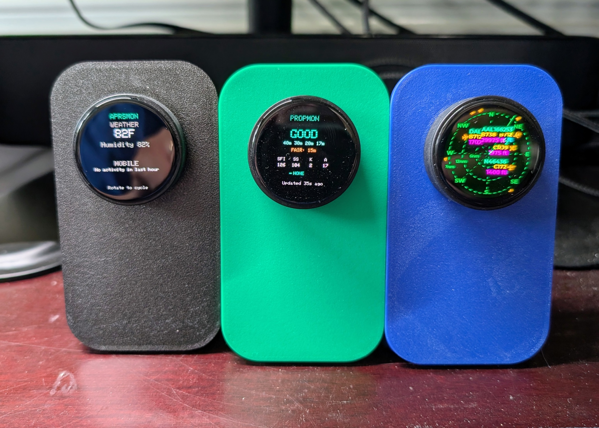
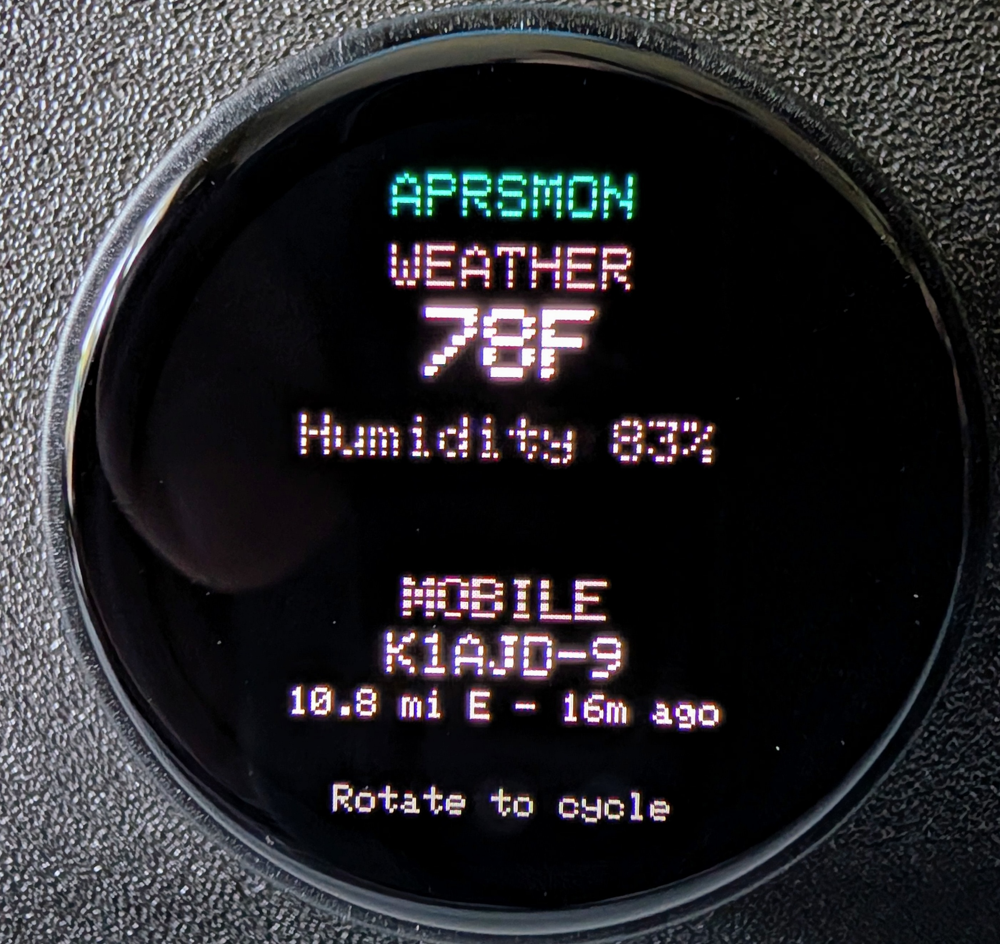
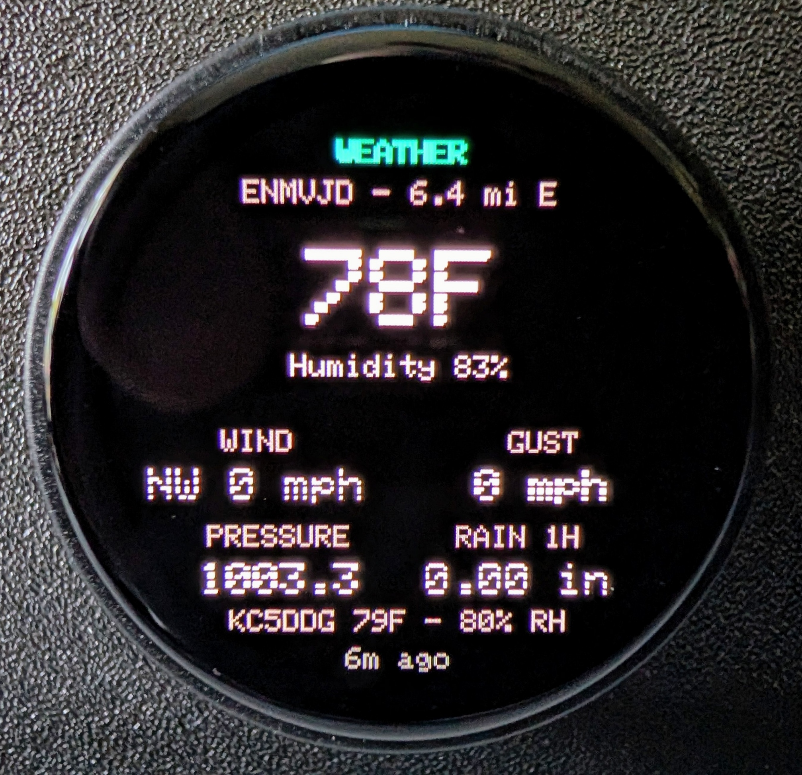
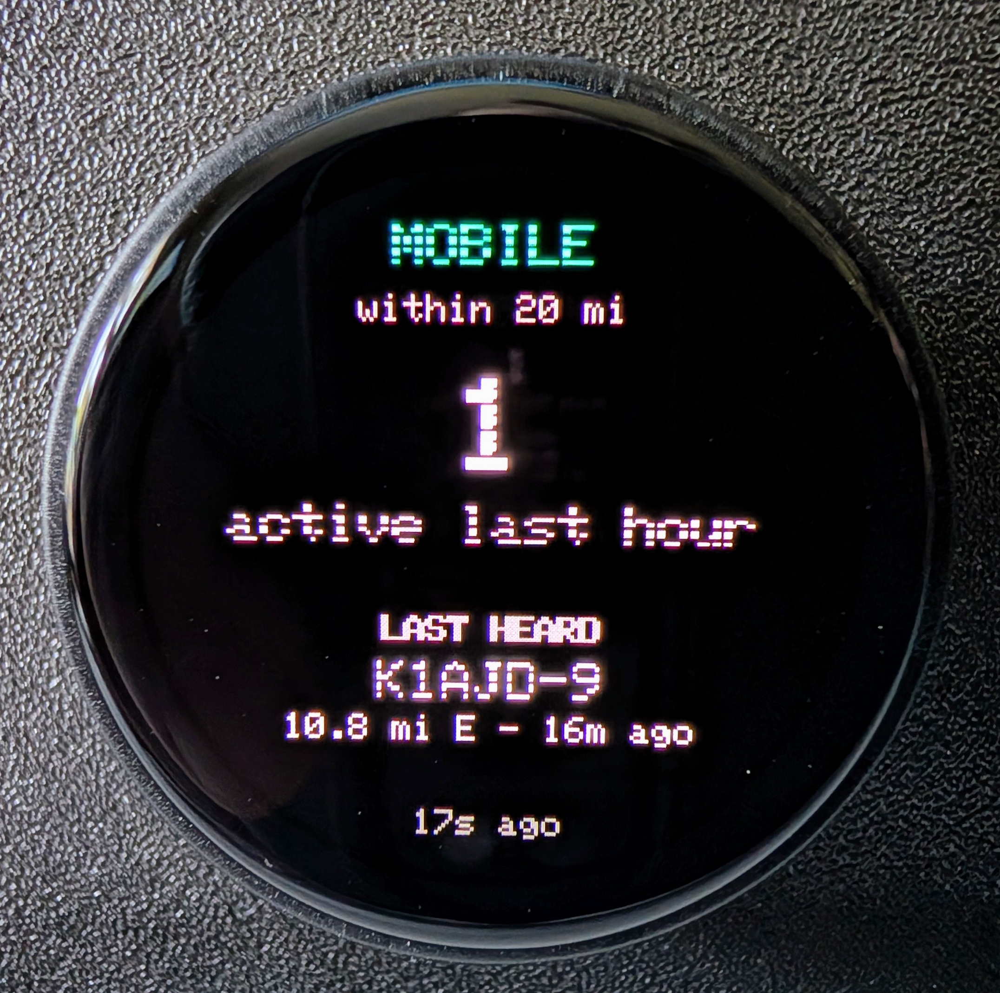
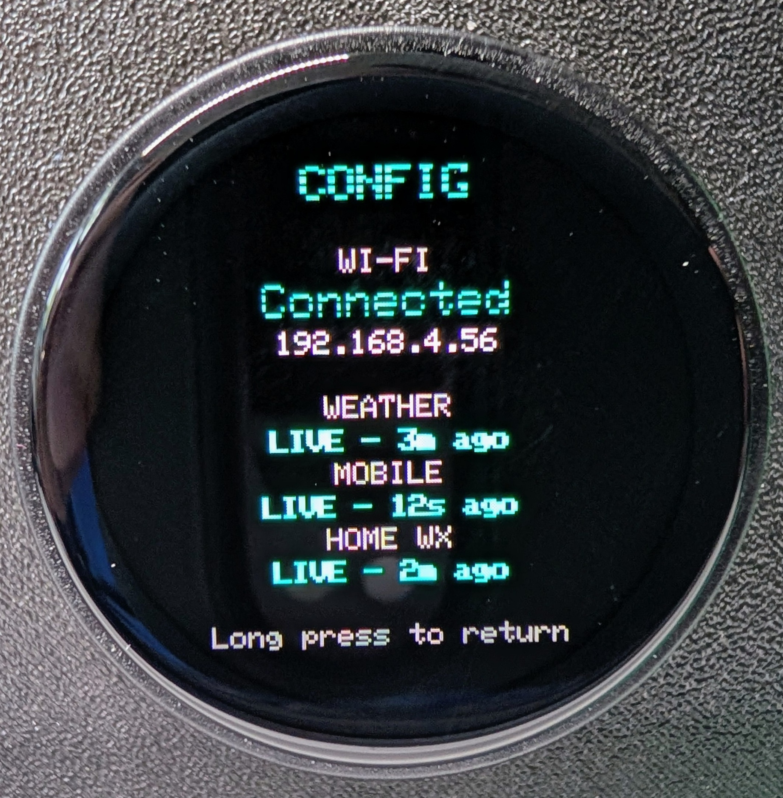
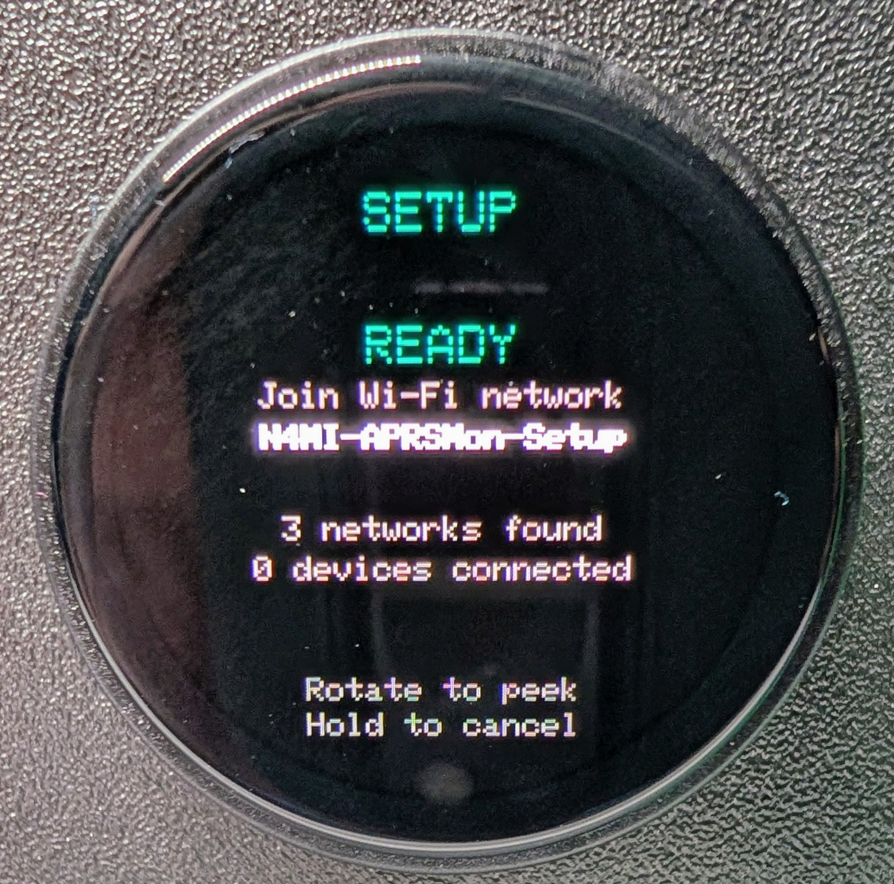

# N4MI APRS Monitor (APRSMon)

> ⚠️ **This repo contains both firmware and a backend server.** The PlatformIO
> project is in [`firmware/`](./firmware/) — **open that subfolder in VS Code,
> not the repo root**, or the PlatformIO extension will not find
> `firmware/platformio.ini` and its sidebar will not appear. The backend
> services live in [`server/`](./server/) and are deployed separately (Docker/
> Portainer).

A small desk instrument showing local APRS activity relevant to a home ham radio
station — part of the **N4MI Desktop Instrument Series**, the sibling project to
[n4mi-propagation-monitor](https://github.com/N4MI73/n4mi-propagation-monitor).
Same hardware platform (LilyGO T-Encoder Pro), same one-glance design philosophy,
different question: not "can I make the contact," but "what's happening in my
local operating area right now."

Unlike Propagation Monitor, this instrument's firmware and backend servers live
in the same repo.

<p align="center">
  
</p>

---

## Status

**All five screens are built and confirmed working on real hardware, including a
real Wi-Fi captive portal setup flow.**

<table>
<tr>
<td width="33%"></td>
<td width="33%"></td>
<td width="33%"></td>
</tr>
<tr>
<td align="center">Overview</td>
<td align="center">Weather</td>
<td align="center">Mobile Activity</td>
</tr>
<tr>
<td width="33%"></td>
<td width="33%"></td>
<td width="33%"></td>
</tr>
<tr>
<td align="center">Config</td>
<td align="center">Wi-Fi Setup</td>
<td></td>
</tr>
</table>

- **Overview:** the front door — a condensed glance at both other screens:
  primary station temp/humidity (plus a rain callout when it's actually
  raining), and the most recently heard mobile station.
- **Weather:** queries the [aprs.fi API](https://aprs.fi/page/api) for 2
  fixed, known local weather station callsigns — not a proximity search,
  since aprs.fi's API doesn't support one by design. Short press swaps which
  station is shown large.
- **Mobile Activity:** genuine local proximity data ("what's moving nearby"),
  via a direct, persistent connection to APRS-IS (the amateur radio
  community's own network), filtered to a 20-mile radius. Shows a 1-hour
  activity count and the most recently heard station; short press switches to
  a "Recent Stations" list (last 3 heard).
- **Alerts:** synthesizes across the other screens' data. Currently checks
  wind gust and rain-rate thresholds against both weather stations, and
  whether N4MI-13 (the operator's home Tempest station, relayed via a
  separate project) has gone quiet for too long. Worst active alert is
  headlined; a calm "ALL CLEAR" state when nothing's active.
- **Config:** real Wi-Fi status/IP, and LIVE/Waiting status with freshness
  age for both backends, plus N4MI-13's own liveness. Reached via long press
  from any screen.
- **Navigation:** rotate to cycle Overview → Mobile → Weather → Alerts → back
  to Overview. Long press opens Config from any screen, remembering where you
  came from. 10-second idle timeout returns to Overview. Both backends fetch
  continuously in the background regardless of which screen is visible.

**Wi-Fi setup:** a real captive portal, no reflashing required to change
networks. Continuing a long press past the point Config normally opens
(~3 seconds total) starts the portal — an open access point, a captive-portal
DNS redirect, and a network-scan-and-select web form, all served directly from
the device. Credentials are stored in NVS; the first boot after flashing
transparently migrates a hardcoded fallback into that storage. The portal
keeps running in the background even while rotating away to check other
screens, and cancels cleanly with a long press from the Setup screen itself.

## Repo layout

```
n4mi-aprs-monitor/
├── images/                      <- README screenshots
├── firmware/                    <- PlatformIO project (open THIS folder in VS Code)
│   ├── platformio.ini
│   ├── include/
│   │   ├── config.h
│   │   ├── display_driver.h
│   │   ├── encoder.h
│   │   ├── wifi_client.h
│   │   ├── wifi_portal.h        <- real captive-portal Wi-Fi setup
│   │   ├── data_client.h        <- Weather
│   │   └── mobile_client.h      <- Mobile Activity
│   └── src/
│       ├── main.cpp             <- screen state machine, all rendering, Alerts logic
│       ├── display_driver.cpp
│       ├── encoder.cpp
│       ├── wifi_client.cpp
│       ├── wifi_portal.cpp
│       ├── data_client.cpp
│       └── mobile_client.cpp
└── server/                      <- Backend services (each its own Docker deployment)
    ├── aprsmon_server.py        <- Weather: polls aprs.fi
    ├── Dockerfile
    ├── requirements.txt
    ├── docker-compose.yml
    ├── aprsmon_mobile.py        <- Mobile Activity: persistent APRS-IS listener
    ├── Dockerfile.mobile
    ├── requirements-mobile.txt
    └── docker-compose-mobile.yml
```

## Hardware

Same as Propagation Monitor: LilyGO T-Encoder Pro, ESP32-S3 (8MB PSRAM), 390×390
round AMOLED (`Arduino_CO5300` driver), rotary encoder with push button.

## Data sources & credit

- **Weather data:** [aprs.fi](https://aprs.fi), via their public API. Used per
  their API terms — specific, known station queries only, not proximity search.
- **Mobile Activity data:** [APRS-IS](https://www.aprs-is.net), the amateur
  radio community's own volunteer-run network, via a direct, receive-only
  connection filtered to a 20-mile radius around the operator's home location.

## License

*(to fill in)*
